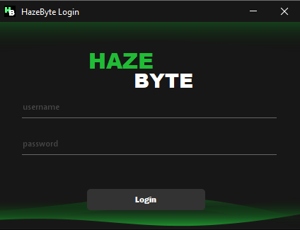
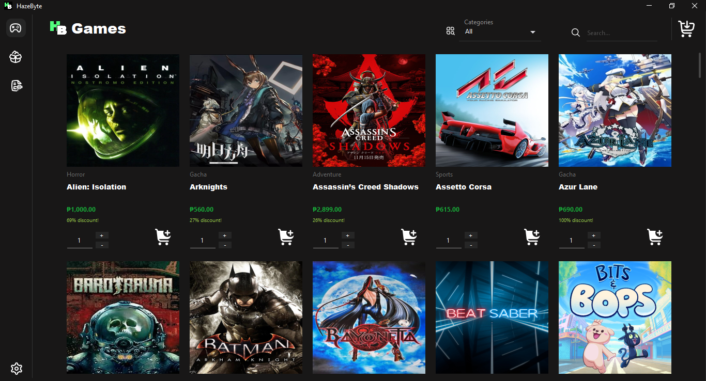
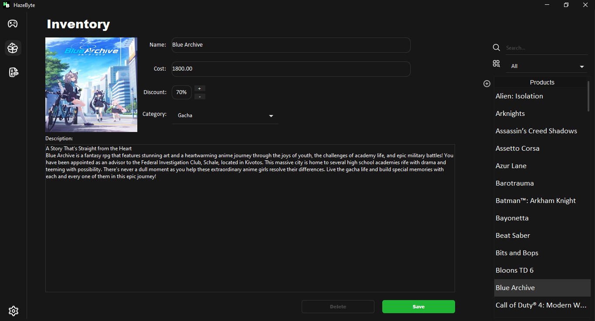
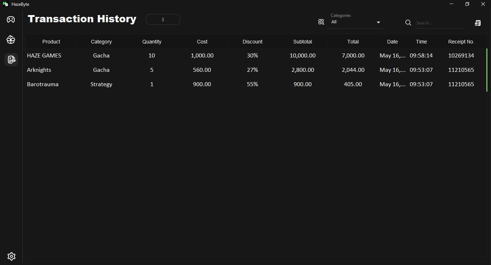
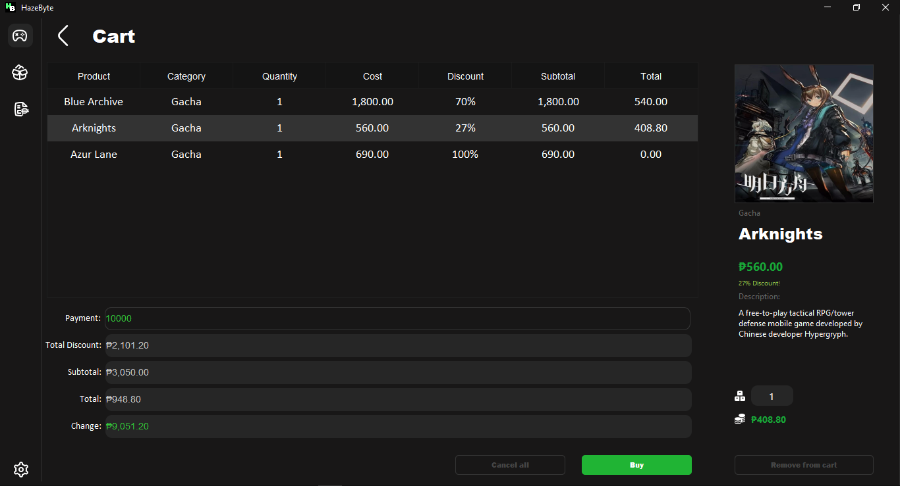
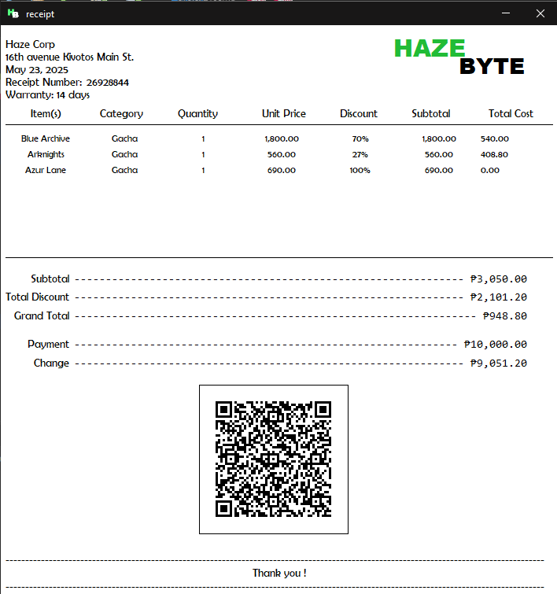

<div align="center">
  
</div>

## Description
A Java-based Game Shop Inventory manangement System created using Swing GUI and SQL database integration using Xampp.


## Features
- User Authentication
- Product Catalog Viewing
- Product Purchasing Module
- Product Management
- Transaction History
- Settings Configuration


## Requirements
- Java JDK
- Java IDE (preferably netbeans)
- xampp sql database


## Screenshots

### Login
Login for added security to the application.



### Home
View and select the available products in the home panel.



### Inventory Management
Manage your products by adding, editing, and deleting them.



### Transaction History
Track your transaction history in the transaction panel.



### Settings
configure settings in the settings panel.


### Cart
Proceed with the transaction by inputting payment in cart panel and buying the selected products.



### Receipt
View the bought products with a receipt.




## How to contribute
1. Clone this repository:
    ```bash
    git clone https://github.com/ImSauce/HazeByte
    ```
2. Make changes and test
3. Submit Pull Request with comprehensive description of changes

 
